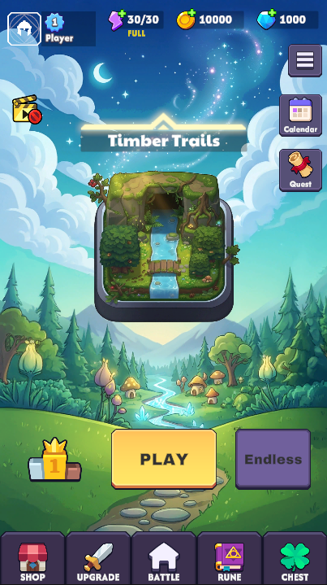
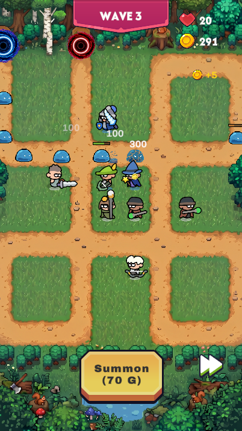

# RNG Rush Defense 🎮

An Android/iOS tower defense mobile game built with Unity and C#.
Summon units by chance, place them strategically, and defend your base from monster waves.

> 🚀 **Expected Release: August 2026** — Google Play & App Store

---

## 📸 Screenshots

  
  &nbsp;&nbsp;&nbsp;
  

---

## 🎯 About
RNG Rush Defense is a luck-based tower defense game where no two runs are the same.
Players summon randomized units, strategically place them on the battlefield,
and fend off waves of increasingly powerful monsters.

---

## ⚙️ Built With
- **Unity** (C#)
- **Android & iOS**
- **Adobe Firefly** — custom sprite & asset generation
- **Git & GitHub** — version control

---

## 🕹️ Features
- 🎲 RNG-based unit summoning system
- 🗺️ Strategic unit placement grid
- 👾 Multiple monster types with wave progression
- ⚔️ Unique unit attack and special ability animations
- 🎨 Custom sprite sheets for units, monsters, and effects
- 📱 Optimized for mobile performance

---

## 🚧 Development Status
| Feature | Status |
|---|---|
| Main Menu | ✅ Complete |
| Unit Animations | ✅ Complete |
| Monster Animations | ✅ Complete |
| Game UI | ✅ Complete |
| Wave System | ✅ Complete |
| Google Play Release | 🔄 In Progress |
| App Store Release | 🔄 In Progress |

---

## 📅 Roadmap
- [ ] Beta testing
- [ ] Performance optimization final pass
- [ ] Google Play Store submission
- [ ] App Store submission
- [ ] Post-launch updates

---

## 👨‍💻 Developer
**Jason Seo** — Software Developer based in Atlanta, GA

---

## ⚠️ Notice
Art assets, sprites, backgrounds, and purchased Unity assets are excluded
from this repository to protect intellectual property and licensing agreements.
Only game scripts and project structure are publicly available.
